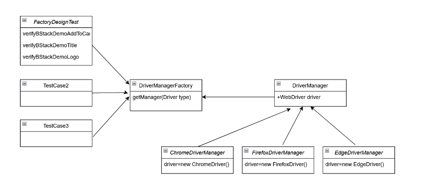

### Factory Design pattern in creation of Webdriver object.

Implementation Steps:
1) **Define an Abstract Class**: Create an abstract class DriverManager with a method get_driver() that returns a driver object.
2) **Implement Specific Driver Managers**: Create a ChromeDriverManager class that extends DriverManager and initializes the Chrome WebDriver.
3) **Create a Factory Class**: Develop a DriverManagerFactory class with a method get_manager(driver_type) to create and return the appropriate driver manager based on the requested browser type.
4) **Define Driver Types**: Create an enumeration DriverType that lists all the supported browser types.

<p align="center">
  
</p>


```
project_root/
├── config/
│   ├── config.yaml
│   └── __init__.py
├── drivers/
│   ├── __init__.py
│   ├── driver_manager_factory.py           # DriverManagerFactory class
│   ├── driver_manager.py *singleton logic  # Abstract DriverManager class
│   ├── chrome_driver_manager.py            # ChromeDriverManager class
│   ├── firefox_driver_manager.py           # FirefoxDriverManager class
│   ├── driver_type.py                      # DriverType enum
```


##### DriverManager
```
class DriverManager(ABC):
    _driver = None
    _browser_name = "chrome"  # Default browser

    @abstractmethod
    @classmethod
    def _init_driver(self):
        pass

    @classmethod
    def get_driver(cls):
        if cls._driver is None:
            cls._init_driver()
        return cls._driver

    @classmethod
    def _init_driver(cls):
        raise NotImplementedError("Subclasses should implement this method.")

    @classmethod
    def quit(cls):
        if cls._driver:
            cls._driver.quit()
            cls._driver = None


```

##### DriverManagerFactory
```
class DriverManagerFactory:
    @staticmethod
    def get_manager(driver_type):
        if driver_type == DriverType.CHROME:
            return ChromeDriverManager()
        elif driver_type == DriverType.FIREFOX:
            return FirefoxDriverManager()
        else:
            raise ValueError(f"Driver type {driver_type} is not supported.")

```
##### DriverManager
```
{
  "base_url": "http://dev.example.com",
  "credentials": {
    "username": "dev_user",
    "password": "dev_pass"
  },
  "other_settings": {}
}

```
##### ChromeDriverManager
```
class ChromeDriverManager(DriverManager):
    @classmethod
    def _init_driver(cls):
        if cls._driver is None:
            service = Service(ChromeDriverManager().install())
            cls._driver = webdriver.Chrome(service=service)
            cls._driver.delete_all_cookies()
            cls._driver.maximize_window()

```

##### FirefoxDriverManager
```
class FirefoxDriverManager(DriverManager):
    @classmethod
    def _init_driver(cls):
        if cls._driver is None:
            service = FirefoxService(GeckoDriverManager().install())
            cls._driver = webdriver.Firefox(service=service)
            cls._driver.delete_all_cookies()
            cls._driver.maximize_window()

```

##### DriverType
```
from enum import Enum

class DriverType(Enum):
    CHROME = "CHROME"
    FIREFOX = "FIREFOX"

```

Example of test class FactoryDesignTest which will use driverManager.getDriver() method to fetch the requested driver instance.
